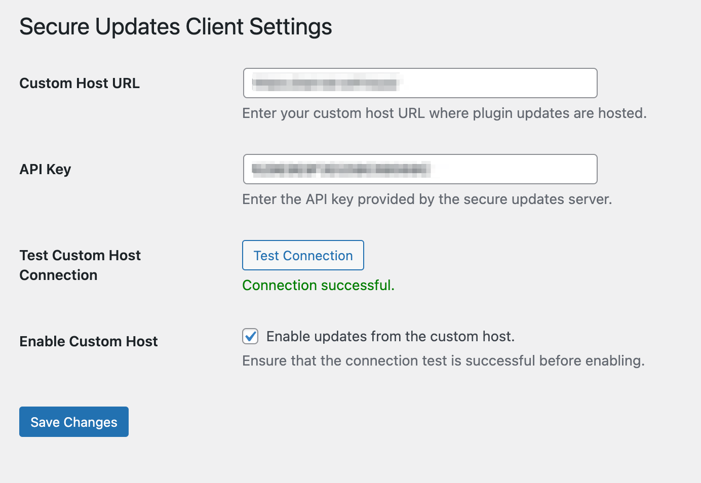

# Secure Updates Client

**Contributors:** Secure Updates Foundation  
**Tags:** plugin updates, custom host, WordPress  
**Requires at least:** 5.0  
**Tested up to:** 6.6.2  
**Requires PHP:** 7.4  
**Stable tag:** 3.1  
**License:** GPLv2 or later  
**License URI:** https://www.gnu.org/licenses/gpl-2.0.html

## Beta Status Notice

This plugin is currently in beta. While it is stable enough for testing and evaluation, please:

1. Test thoroughly in a staging environment first
2. Maintain backups before updating plugins
3. Monitor logs for any update failures
4. Report issues through our GitHub repository

Not recommended for mission-critical production sites without thorough testing.

## Description

Secure Updates Client is designed to seamlessly integrate with [Secure Updates Server](https://github.com/secure-updates/secure-updates-server), providing a complete solution for managing WordPress plugin updates through your own infrastructure. While it can work with any compatible update server, it offers zero-configuration integration with Secure Updates Server, allowing you to immediately start managing plugin updates through your own trusted infrastructure. The plugin intelligently overrides the update URLs for plugins hosted on WordPress.org while leaving custom-hosted plugins unaffected.

Together with Secure Updates Server, this client enables you to:
- Mirror and serve plugin updates from your own infrastructure
- Ensure plugin integrity through checksum verification
- Control and monitor plugin updates across your WordPress sites
- Maintain a secure, private plugin update channel
- Automatically sync new plugins with your update server

The client can also be configured to work with other mirrored plugin repositories or custom update servers that implement the required API endpoints.

### Features

- **Custom Update URL:** Redirects plugin update checks to your specified custom host for supported plugins
- **Selective Overriding:** Only overrides update URLs for plugins hosted on WordPress.org
- **Secure Update Notifications:** Displays secure update messages with checksum verification
- **API Key Integration:** Secure authentication with your custom update host
- **Connection Testing:** Test host connectivity from settings page
- **Automated Plugin Sync:** Daily synchronization of installed plugins
- **Real-time Plugin Change Handling:** Immediate host notification of plugin changes
- **Version Compatibility Checking:** Ensures plugins meet minimum requirements
- **Rate Limiting:** Prevents API overload
- **Checksum Verification:** Validates plugin integrity before installation

## System Requirements

- WordPress 5.0 or higher
- PHP 7.4 or higher
- SSL support (required for secure communications)
- MySQL 5.6 or higher
- Server Requirements:
   - PHP memory limit: 64MB minimum
   - Max execution time: 30 seconds minimum
   - SSL certificate properly configured
   - Outbound HTTPS requests allowed

## Installation

1. **Download the Plugin:**
   - Clone the repository or download the ZIP file

2. **Install via WordPress Admin:**
   - Go to `Plugins` > `Add New` > `Upload Plugin`
   - Upload the `secure-updates-client.zip` file
   - Click `Install Now` and then `Activate`

3. **Configure Custom Host URL:**
   - Navigate to `Settings` > `Secure Updates Client`
   - Enter your custom host URL
   - Enter your API key
   - Test the connection
   - Enable updates from the custom host
   - Save the settings

## Quick Start Guide

1. After installation, go to the Secure Updates Client settings page
2. Enter your custom host URL (e.g., `https://your-secure-updates-server.com`)
3. Input the API key provided by your secure updates server
4. Click "Test Connection" to verify connectivity
5. Enable the custom host if the connection test succeeds
6. Save your settings

## Documentation

- [Changelog](CHANGELOG.md) - Detailed version history and updates
- [Security Guide](SECURITY.md) - Security best practices and configuration
- [API Integration](API_INTEGRATION.md) - Complete API documentation and examples
- [Deployment Checklist](DEPLOYMENT.md) - Step-by-step deployment guide

Please review these documents before deploying in a production environment.

## Security Considerations

### API Key Management
- Store API keys securely
- Use unique keys per site
- Rotate keys periodically
- Never share keys in public repositories

### SSL Configuration
- Valid SSL certificate required
- Keep SSL certificates up to date
- Configure proper SSL verification

### Firewall Considerations
- Allow outbound HTTPS connections to custom host
- Configure rate limiting if needed
- Monitor for suspicious activity

## Troubleshooting

### Common Connection Issues
1. **Connection Failed**
   - Verify custom host URL
   - Check SSL certificate
   - Confirm firewall settings

2. **API Authentication Failed**
   - Verify API key
   - Check key permissions
   - Ensure key hasn't expired

3. **Plugin Sync Issues**
   - Check server connectivity
   - Verify WordPress cron is running
   - Monitor error logs

## Support and Contribution

- Report issues on our [GitHub repository](https://github.com/secure-updates-foundation/secure-updates-client/issues)
- Join our [Community Forum](https://community.secure-updates.org)
- Contribute via Pull Requests

## License

This plugin is licensed under the GPLv2 or later. See the LICENSE file for details.